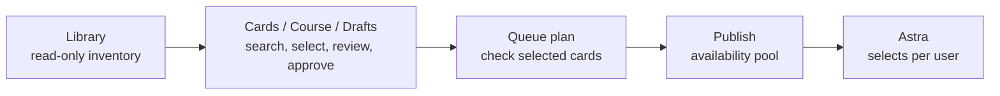
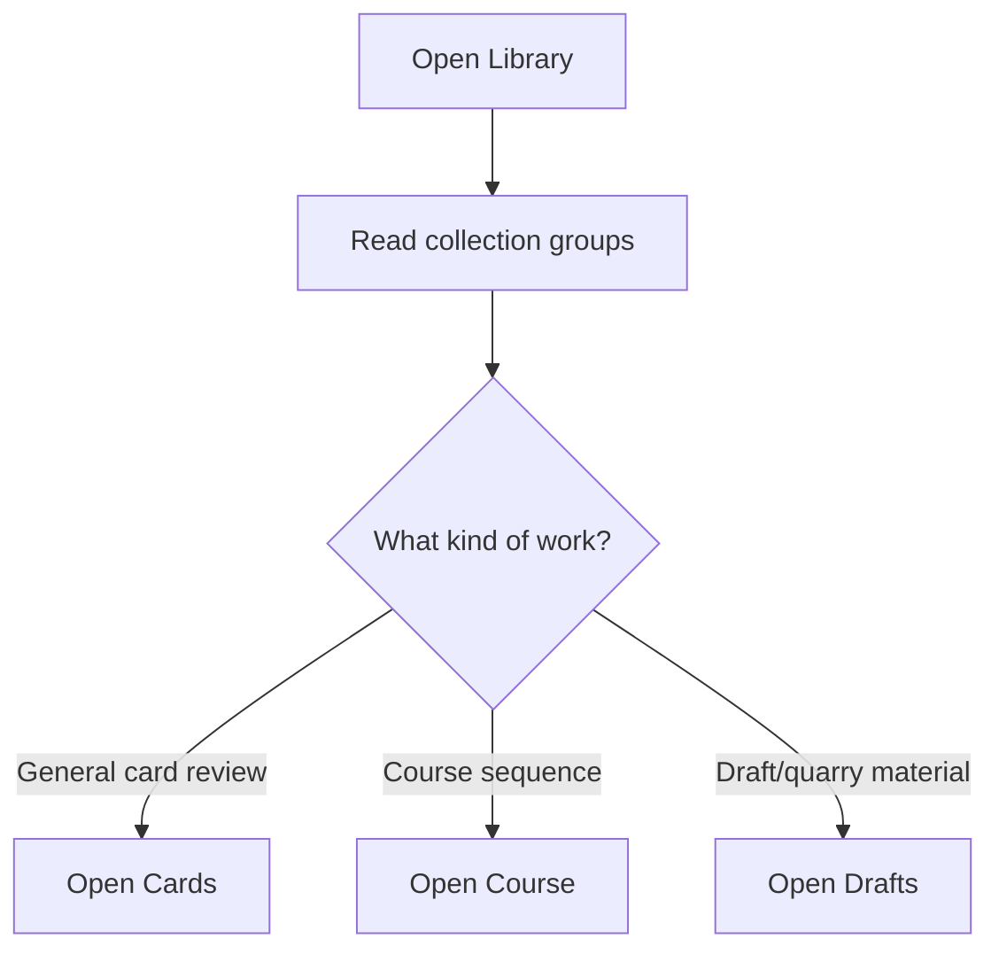
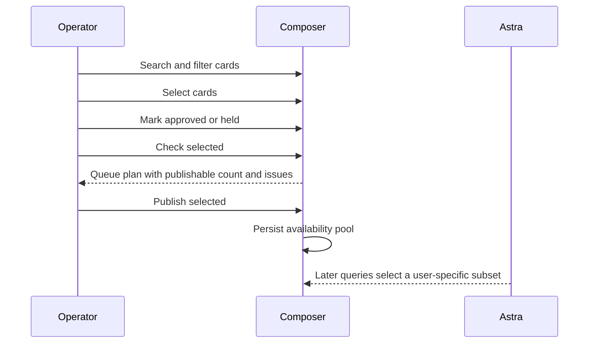

# Composer User Guide

Composer is Astra's internal workbench for preparing cards before they enter a user's private Astra experience.

The shortest version:

- Composer finds, reviews, and prepares card material.
- Astra renders the user experience.
- Composer publishes approved cards into shared availability pools.
- Astra creates each user's subset later from profile, path, timing, and preferences.
- Library is read-only inventory.
- Cards, Course, and Drafts are working surfaces.
- Review and Onboarding are controlled publish surfaces.

## Mental Model

Composer is not the public app. It is an operator surface. Its job is to keep source material organized, make review decisions explicit, and publish only intentional availability pools for Astra to query.

## Primary Navigation

| Section | What it is for | Use it when |
|---|---|---|
| Dashboard | Health and posture overview | You want to confirm Composer is configured, connected, and holding the expected card inventory. |
| Drafts | Draft card fixture workbench | You want to inspect or prepare quarry material still held as draft workflow material. |
| Cards | Main card workbench | You want to search, filter, select, approve, hold, save, plan, or publish cards. |
| Course | Astrology 101 workbench | You want to inspect lessons, quizzes, tests, certification cards, and course-sequenced material. |
| Library | Read-only inventory | You want to understand what material exists and where it belongs before editing or publishing. |
| Settings | Configuration and boundary status | You want to confirm port, access mode, token posture, and Astra endpoint boundaries. |

There are also early posture pages for Voices and Offers. Legacy direct Review and Onboarding routes may still exist for lower-level checks, but they are not the primary operator path for pool publishing.

## Start Here: Library

Library is the safest reorientation page. It answers:

- How many card groups exist?
- How many total cards are in the starter set?
- Which cards have images, prompts, lessons, quizzes, tests, or certification material?
- Which collection should be opened in Cards or Course?

Library does not publish. Treat it as inventory and map-reading.

## The Cards Workbench

Cards is the main operating surface.

You can:

- Search by title, id, lane, or tag.
- Filter by feed, type, lane, status, and tags.
- Select individual cards or all visible cards.
- Mark selected cards as Reviewing, Approved, or Held.
- Add decision notes.
- Save and load a server draft.
- Check selected cards before publishing.
- Publish an approved single card or approved selected cards into the shared availability pool.

The important rule: a card must be approved before it can enter the pool.

## Queue States

| State | Meaning |
|---|---|
| Reviewing | The card is selected or active, but not ready to publish. |
| Approved | The operator has decided the card may enter the shared pool. |
| Held | The card should not publish yet. |

Approval is not decoration. It is the publish gate.

## Normal Publish Path

Use Check selected before Publish selected. It gives you a queue plan: how many cards can enter the pool, which still need review, and the batch limit.

## Draft Memory

Composer has two kinds of memory that matter right now:

- Local draft memory: quick browser-side continuity while you are working.
- Server draft memory: saved operator state that can survive a reload or handoff.

Server drafts can include selected cards, queue states, decision notes, and the last publish plan summary.

Composer no longer treats database query windows as durable memory. Search and filter results can carry a deterministic cache key for future edge caching, but human review state is the thing that belongs in durable persistence.

## Card Detail

Open a card detail page when you need to inspect one card deeply.

Card detail shows:

- The rendered card preview.
- Type, status, feed, lane, course section, source, and image readiness.
- Full card body.
- Quiz payload, when present.
- Availability metadata.
- A compact control to merge that card into the relevant queue draft.

Use card detail when a card needs close reading before approval.

## Course

Course is the Astrology 101 workbench.

It organizes cards into sections and shows:

- Lesson counts.
- Quiz counts.
- Test and certification counts.
- First and last card per section.
- Assessment widgets with answer visibility.
- The same queue workflow as Cards, scoped to course material.

Use Course when sequence matters. Use Cards when inventory breadth matters.

## Settings

Settings tells you whether Composer is in the expected operating posture:

- Local port is reserved for Composer.
- Access is internal.
- The internal publish token is configured or missing.
- Composer has no Supabase Auth dependency.
- Composer talks to Astra through contract-shaped internal endpoints.

If publishing fails, Settings is the first place to check after confirming the Composer server and database are healthy.

## What Persists

| Thing | Persisted now? | Why |
|---|---:|---|
| Operator draft state | Yes | Protects human review work. |
| Publish plans | Yes | Preserves the checked batch decision before commit. |
| Published availability pools | Yes | This is the shared source pool Astra can query from. |
| Query result windows | No | This is cache work, not product memory. |
| Edge cache key | Yes, as metadata | Keeps near-future edge caching ready without turning Postgres into a cache. |

## Boundaries To Remember

- Composer composes; Astra renders.
- Composer is internal; Astra is user-facing.
- Composer can use public-safe source material.
- Availability pool publishing must not target a specific user.
- No Supabase carryover belongs in Composer.
- User-specific streams are selected later by Astra from approved availability.

## Quick Operator Recipes

### Reorient

1. Open Library.
2. Read the inventory cards at the top.
3. Open Cards for broad work or Course for Astrology 101.

### Prepare A Batch

1. Open Cards or Course.
2. Search or filter to the intended set.
3. Select cards.
4. Mark ready cards Approved.
5. Click Check selected.
6. Resolve any plan issues.
7. Click Publish selected.

### Save Work In Progress

1. Select cards.
2. Set queue states.
3. Add decision notes where needed.
4. Click Save draft.

### Resume Work

1. Open the same workbench scope.
2. Click Load server draft.
3. Review the restored selected cards, states, notes, and last plan.

## Current Product Posture

Composer is usable for inventory, review, approval, draft persistence, publish planning, pool publishing, course inspection, and availability serving.

Composer is not yet a full authoring CMS, offer engine, or generalized cache system. That is intentional. The current product promise is controlled preparation and shared availability, not speculative content infrastructure.
