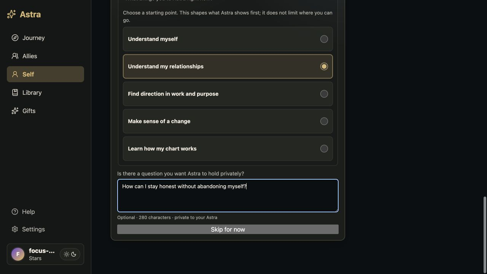
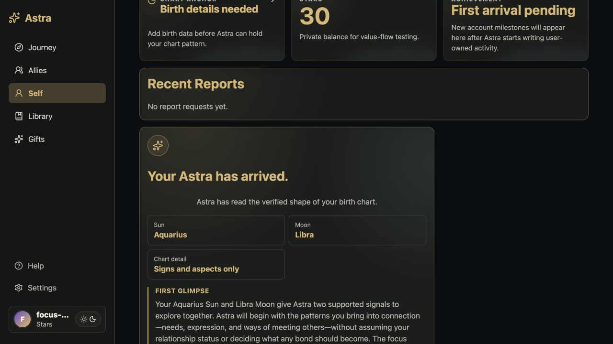
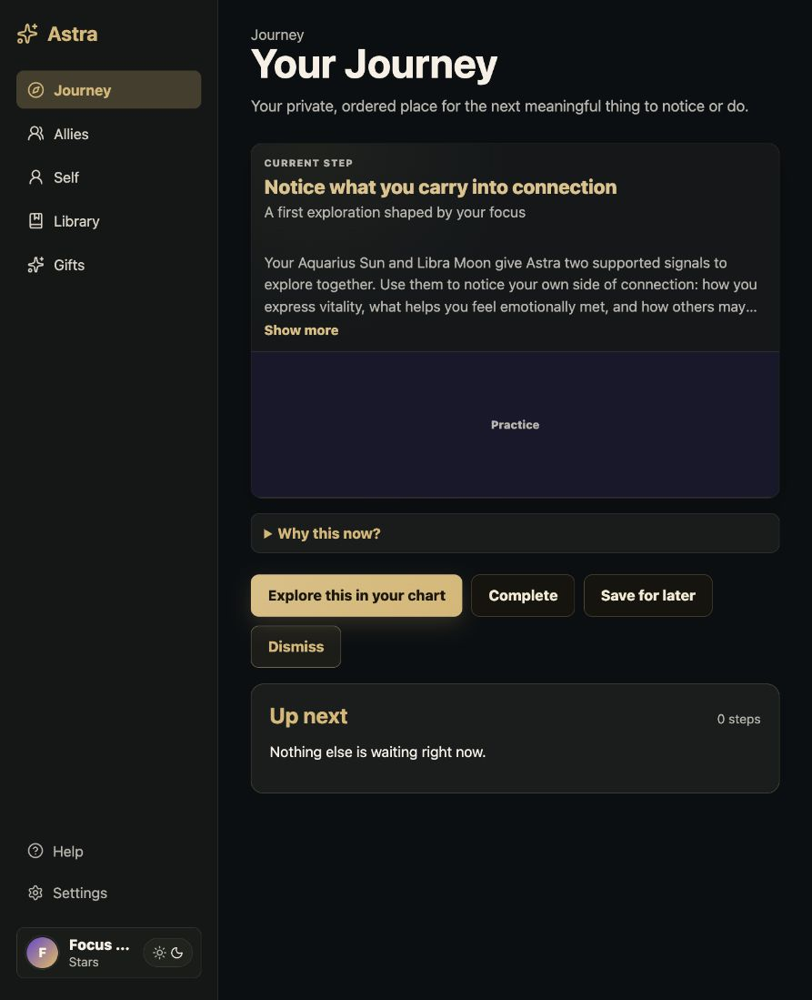
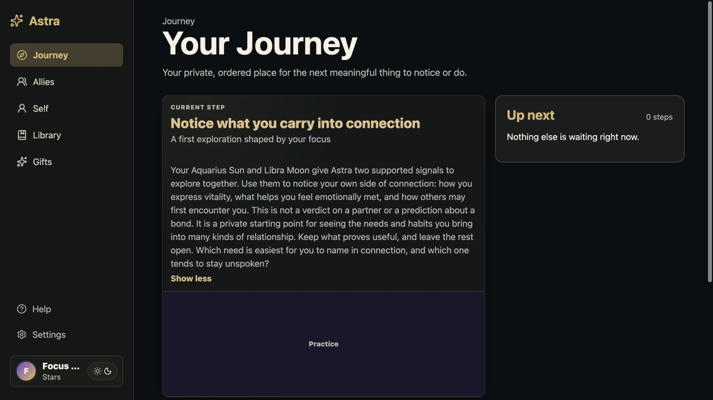

# Focus-first onboarding review

Verified on 2026-08-02 from `codex/focus-first-onboarding` using an authenticated customer in the production build.

Scenario: **Understand my relationships**, with an optional private question and date-only chart data. The private question is saved only in profile metadata and the chart request; it does not appear in Arrival, Journey, display payloads, provenance, logs, reports, or artifacts.

## Starting focus

## Chart Arrival

## First Journey step

## Why this now?

## Acceptance evidence

- Copy eval: all five focus values plus skip; Arrival 45–90 words; Journey 90–150 words; no prediction, destiny, authority, or private-question leakage.
- Persistence: canonical mutable focus in `app_user_profiles.metadata.explorerFocus`; immutable snapshot in chart `intent`, `question`, and `context.explorerFocus`; no migration.
- Entry transaction: Chart Arrival completion, one deterministic `focus_first_exploration` upsert, and onboarding completion commit atomically; retries preserve the Journey item state.
- Non-creation: no report request/result, artifact, credit write, or `composer_onboarding_card` is created.
- Browser: the complete authenticated path passed at 1440×900, 820×1180, and 390×844 against the production build with no horizontal overflow.
